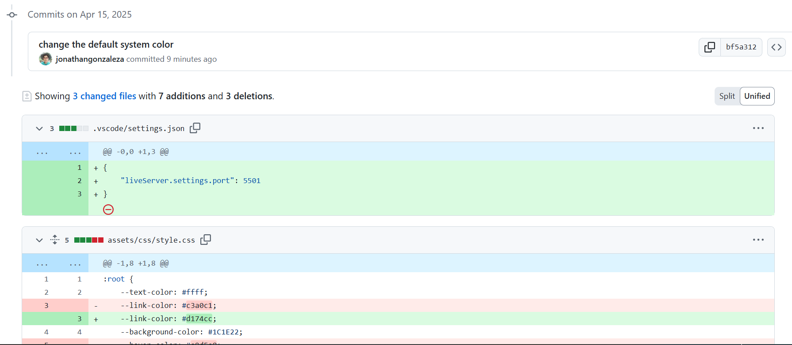
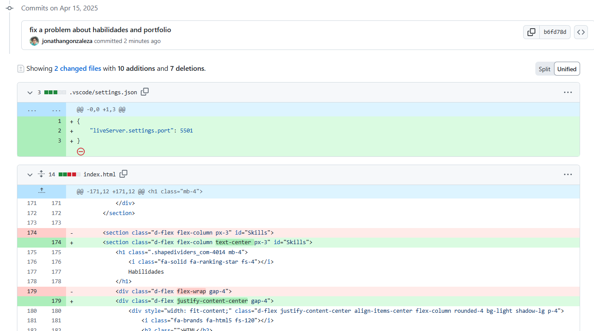

## Titulo
Prueba Módulo 1: Curriculum Vitae

* [Link al Repositorio](https://github.com/jonathangonzaleza/jonathangonzalez.github.io#)

## Fork a 2 proyectos

1. forkeado a Joselyn
* Link: [Fork a repositorio de Joselyn](https://github.com/jonathangonzaleza/Newportafolio)

* Commit bf5a312: [Link al commit](https://github.com/Joselyn-argg/Newportafolio/compare/main...jonathangonzaleza:Newportafolio:main)

2. forkeado a Lurianny Vásquez

* Link: [Fork a repositorio de Lurianny](https://github.com/jonathangonzaleza/lurianny.github.io)

* Commit b6fd78d: [Link al commit](https://github.com/Lurianny/lurianny.github.io/compare/main...jonathangonzaleza:lurianny.github.io:main)

